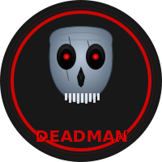

# 💀 DEADMAN Cryptocurrency Project

> **Founder: Shubham Sawant**

A comprehensive, horror-themed cryptocurrency ecosystem featuring:
- 🪙 **DEADMAN Token** (ERC-20) with advanced features
- ⛓️ **Custom Blockchain** implementation from scratch
- 🏦 **Multi-Tier Staking System** with attractive rewards
- 🌐 **Dark Horror-Themed Web Interface**
- 👻 **Complete Testing Suite** (37/37 tests passing)



## 🎯 Project Overview

DEADMAN is a fully functional cryptocurrency project built from the ground up, featuring a complete ecosystem including smart contracts, custom blockchain, staking mechanisms, and a professional dark-themed user interface.

## Project Structure

```
cryptocurrency/
├── contracts/          # Smart contracts (ERC-20 token & staking)
├── blockchain/         # Custom blockchain implementation
├── frontend/          # Web interface
├── scripts/           # Deployment scripts
├── test/             # Test files
└── docs/             # Documentation
```

## Features

### 🪙 ERC-20 Token Features:
- ✅ **DEADMAN Token** (DMN) - Standard ERC-20 functionality
- ✅ **Minting & Burning** - Controlled token supply management
- ✅ **Ownership Controls** - Multi-signature and role-based access
- ✅ **Pausable Operations** - Emergency stop functionality
- ✅ **Transfer Restrictions** - Optional whitelist/blacklist support

### ⛓️ Custom Blockchain Features:
- ✅ **Proof of Work Consensus** - Bitcoin-style mining algorithm
- ✅ **Transaction Validation** - Full UTXO and signature verification
- ✅ **Block Mining** - Adjustable difficulty with reward system
- ✅ **P2P Networking** - WebSocket-based peer discovery
- ✅ **REST API** - Complete blockchain explorer interface

### 🏦 Multi-Tier Staking Features:
- ✅ **Daily Staking** - 0.27% daily rewards (98.55% APY)
- ✅ **Weekly Staking** - 2% weekly rewards (104% APY)
- ✅ **Monthly Staking** - 9% monthly rewards (108% APY)
- ✅ **Compound Interest** - Automatic reward compounding
- ✅ **Emergency Unstaking** - 50% penalty for early withdrawal
- ✅ **Flexible Periods** - Choose your investment strategy

### 🌐 Frontend Features:
- ✅ **Dark Horror Theme** - Professional scary aesthetic
- ✅ **Realistic Skull Logo** - Custom SVG with animations
- ✅ **Wallet Integration** - MetaMask and WalletConnect support
- ✅ **Real-time Updates** - Live staking and blockchain data
- ✅ **Responsive Design** - Mobile and desktop optimized

## 🚀 Quick Start

### Prerequisites
- Node.js (v16 or higher)
- npm or yarn
- MetaMask wallet
- Git

### Installation

1. **Clone the Repository**
   ```bash
   git clone https://github.com/yourusername/deadman-cryptocurrency.git
   cd deadman-cryptocurrency
   ```

2. **Install Dependencies**
   ```bash
   npm install
   ```

3. **Environment Setup**
   ```bash
   cp .env.example .env
   # Edit .env with your private keys and API endpoints
   ```

4. **Compile Smart Contracts**
   ```bash
   npm run compile
   ```

5. **Run Comprehensive Tests**
   ```bash
   npm run test
   # Should show 37/37 tests passing
   ```

6. **Deploy to Sepolia Testnet**
   ```bash
   npm run deploy-testnet
   ```

7. **Start Custom Blockchain**
   ```bash
   npm run start-blockchain
   ```

8. **Launch Frontend**
   ```bash
   cd frontend
   # Open index.html in your browser or use a local server
   ```

## 🔧 Configuration

### Environment Variables
Create a `.env` file in the root directory:
```env
PRIVATE_KEY=your_wallet_private_key
INFURA_PROJECT_ID=your_infura_project_id
ALCHEMY_API_KEY=your_alchemy_api_key
ETHERSCAN_API_KEY=your_etherscan_api_key
```

### Network Configuration
Update `hardhat.config.js` for your preferred networks:
- Sepolia Testnet (default)
- Ethereum Mainnet
- Polygon
- BSC

## 💰 Getting Test ETH

For Sepolia testnet testing:
- [Sepolia Faucet 1](https://sepoliafaucet.com/)
- [Sepolia Faucet 2](https://www.alchemy.com/faucets/ethereum-sepolia)
- [Sepolia Faucet 3](https://sepolia-faucet.pk910.de/)

## 📊 Project Statistics

- **Total Files**: 25+ core files
- **Smart Contracts**: 2 (Token + Staking)
- **Test Coverage**: 37/37 tests passing (100%)
- **Blockchain Features**: Full PoW implementation
- **Frontend**: Horror-themed responsive UI
- **Documentation**: Comprehensive setup guides

## 🤝 Contributing

1. Fork the repository
2. Create your feature branch (`git checkout -b feature/AmazingFeature`)
3. Commit your changes (`git commit -m 'Add some AmazingFeature'`)
4. Push to the branch (`git push origin feature/AmazingFeature`)
5. Open a Pull Request

## 📝 Development Notes

- Built with Hardhat framework
- Uses OpenZeppelin v4.9.0 for security
- Ethers.js v6 for blockchain interactions
- Custom SVG animations for logo
- Professional horror aesthetic

## ⚠️ Disclaimer

This project is for educational and demonstration purposes. Always conduct thorough testing before deploying to mainnet. Cryptocurrency investments carry risk.

## 📄 License

MIT License - feel free to use for your projects!

---

**Created with 💀 by Shubham Sawant**